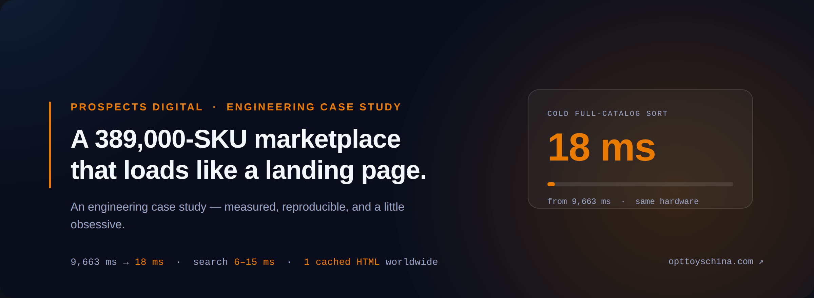
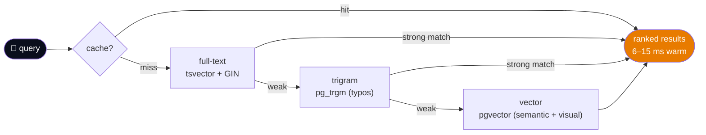
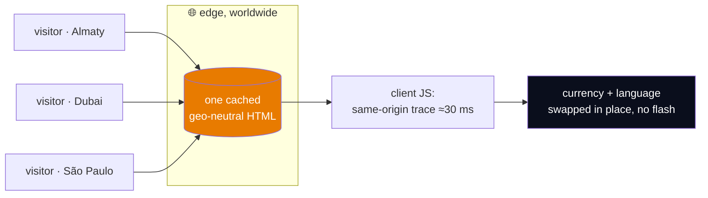

<a name="top"></a>

<div align="center">



<br><br>

# A 389,000‑SKU marketplace that feels like a landing page

**An engineering case study by Prospects Digital** — measured, reproducible, and a little obsessive.

<br>

[](https://opttoyschina.com)
[](https://opttoyschina.com/optom/)
[](#-from-96-seconds-to-18-milliseconds)

[](https://pagespeed.web.dev/analysis?url=https%3A%2F%2Fopttoyschina.com%2F)
[](#-photograph-a-toy-find-the-factory-sku)

<br>


<br>

> We didn't write this to open‑source our codebase. We wrote it so you can **audit the decisions**.
> Every number below is measured, not marketed — and §7 shows you how to verify them from your own browser.

</div>

---

## 📚 Table of contents

- [⚡ TL;DR for the impatient reviewer](#-tldr-for-the-impatient-reviewer)
- [🧩 The brief (and why it's harder than it sounds)](#-the-brief-and-why-its-harder-than-it-sounds)
- [🚀 From 9.6 seconds to 18 milliseconds](#-from-96-seconds-to-18-milliseconds)
- [🎯 The one‑word bug: deterministic pagination](#-the-one-word-bug-deterministic-pagination-at-385k-rows)
- [🔍 Search in 6–15 ms — and it proves it to you](#-search-that-returns-in-615-ms--and-proves-it-to-you)
- [🌍 One cached HTML for the whole world](#-one-cached-html-for-the-whole-world-geo-neutral-ssr)
- [🕷️ Crawl engineering: indexing 389,000 pages](#%EF%B8%8F-crawl-engineering-getting-389000-pages-actually-indexed)
- [📏 How we measure (the audit, not the anecdote)](#-how-we-actually-measure-the-audit-not-the-anecdote)
- [📊 Results at a glance](#-results-at-a-glance)
- [⚡ Postscript: shipping 91 to 96 in one day](#-postscript-shipping-91-to-96-in-one-day)
- [🤝 Want a system like this?](#-want-a-system-like-this-work-with-prospects-digital)

---

## ⚡ TL;DR for the impatient reviewer

| | The fire | The fix | The number |
|---|---|---|---:|
| 🐘 | Cold "sort whole catalog by price" | data layout, not horsepower | **9,663 ms → 18 ms** |
| 🔁 | Pagination duplicates/gaps over 385k tie‑prone rows | a one‑word tie‑breaker | **deterministic** |
| 🌍 | "Local currency" vs "global cache" — pick one | geo‑neutral SSR + client locale | **1 cached HTML worldwide** |
| 🕷️ | WAF silently 403‑ing a search engine we courted | verified‑crawler rule, verified from the engine's side | **403 → 200** |
| 🔍 | Full‑catalog search under a latency budget | FT → trigram → vector cascade | **6–15 ms, provable** |
| 📷 | You can't *type* a shape | in‑browser camera search over the whole catalog | **photo → factory SKU** |

**Google's own verdict** (PageSpeed / Lighthouse lab, homepage, three consecutive runs on 25 Jul 2026): performance **98–99/100 desktop · 96–97/100 mobile**, SEO **100/100**, Total Blocking Time **0 ms**, CLS **0.001**. Mobile started at 91 — the postscript at the end of this document is the story of closing that gap. Lab scores wobble a point or two between runs — [run it yourself](https://pagespeed.web.dev/analysis?url=https%3A%2F%2Fopttoyschina.com%2F) for today's number.

If any row describes a fire you're currently fighting, the sections below are the post‑mortems.

<p align="right">(<a href="#top">back to top</a>)</p>

---

## 🧩 The brief (and why it's harder than it sounds)

The client came to us with a deceptively ordinary ask: a B2B catalog for wholesale toy buyers, sourcing direct from Chinese factories, with prices visible up front and order‑from‑one‑box economics. Nothing exotic on the surface.

The exotic part was the shape of the data. Roughly **389,000 products**, a young domain with no accumulated search trust, buyers spread across many countries and currencies, and a hard product requirement that *prices are shown before login*. That combination quietly breaks four things at once:

1. **Database.** A 389k‑row catalog sorted and filtered on every visit is where naïve schemas fall down.
2. **Caching.** "Show local currency" plus "cache globally" are, by default, mutually exclusive.
3. **Crawlability.** A young domain gets a crawl *ration*, not a crawl *budget*. Waste it and 389k pages never get indexed.
4. **Trust.** Open pricing means the numbers on the page **are** the pitch. They have to be instant and consistent, or the value proposition dies on first paint.

The rest of this document is how we closed each of those. Representative SQL and headers below — identifiers sanitized, shapes intact, no secrets. The measurements are from the production system.

> **For the buyer reading over the engineer's shoulder:** everything below is the kind of decision we make on your project too. You don't need to understand the SQL. You need to know that someone will.

<p align="right">(<a href="#top">back to top</a>)</p>

---

## 🚀 From 9.6 seconds to 18 milliseconds

### The symptom

"Sort the whole catalog by price" — the single most common thing a wholesale buyer does — took **9,663 ms on a cold query**. That is not a marketplace. That is a loading screen with a logo on it.

### The diagnosis

The instinct in the room was *"we need a bigger box"* or *"add a read replica."* We ran `EXPLAIN (ANALYZE, BUFFERS)` first, because the plan tells the truth and the vibe does not.

The problem was **data layout, not horsepower**. The gate that decides what appears on the storefront lived in a narrow table (visibility, availability), while the sort key — `price` — lived in the wide `products` table with dozens of columns. No single index can cover a predicate on one table and an `ORDER BY` on another. So the planner did the only thing it could:

```text
Limit
  ->  Gather Merge
        ->  Sort                          -- top-N heapsort, ~385k rows
              Sort Key: p.price
              ->  Parallel Hash Join
                    ->  Parallel Seq Scan on products p   -- gigabytes, cold
                    ->  Hash
                          ->  Seq Scan on storefront_gate g
```

A parallel sequential scan across gigabytes, a hash join, and a top‑N heapsort over ~385,000 qualifying rows — to answer a question about **24 rows on screen**.

### The fix — three unglamorous moves

**1. Denormalize the sort keys into the narrow table.** `price` and `moq` were copied into the same slim table the storefront already filters on. Now the predicate *and* the sort key live in one place, and one index can cover both.

**2. Keep the mirror honest with a trigger.** Denormalization is a lie you tell your database; a trigger is how you keep the lie true.

<details>
<summary><b>📄 Show the sync trigger</b> <i>(representative shape)</i></summary>

```sql
CREATE OR REPLACE FUNCTION sync_storefront_sortkeys()
RETURNS trigger AS $$
BEGIN
  UPDATE storefront_gate g
     SET price = NEW.price,
         moq   = NEW.moq,
         updated_at = now()
   WHERE g.product_id = NEW.id
     AND (g.price IS DISTINCT FROM NEW.price
       OR g.moq   IS DISTINCT FROM NEW.moq);
  RETURN NEW;
END;
$$ LANGUAGE plpgsql;

CREATE TRIGGER trg_sync_sortkeys
AFTER INSERT OR UPDATE OF price, moq ON products
FOR EACH ROW EXECUTE FUNCTION sync_storefront_sortkeys();
```

</details>

**3. Partial indexes shaped exactly like the queries.** The storefront only ever sorts *visible, in‑stock* items — so the index only indexes those. Smaller, hotter, a perfect match for the planner.

<details>
<summary><b>📄 Show the indexes</b></summary>

```sql
-- Sort path: visible + in stock, ordered by price, unique tie-breaker included (see next section)
CREATE INDEX idx_gate_price_id
    ON storefront_gate (price, id)
    WHERE visible AND in_stock;

-- "Cheapest first within a category" hot path
CREATE INDEX idx_gate_cat_price_id
    ON storefront_gate (category_id, price, id)
    WHERE visible AND in_stock;
```

</details>

### The result

| Query | Before | After |
|---|---:|---:|
| Cold full‑catalog sort by price | **9,663 ms** | **18 ms** |
| Warm category sort (cheapest first) | ~1,900 ms | **< 10 ms** |
| Rows physically read to render 24 | ~385,000 | 24 + index walk |

*Same hardware. Same dataset. The plan collapsed from a seq‑scan + heapsort into an index walk that stops at the `LIMIT`.*


> 💡 **The lesson worth stealing:** before you scale out, read the plan. Most *"we need a bigger database"* problems are *"our data is in the wrong shape for the question we ask most often"* problems. Horizontal scaling makes the wrong shape more expensive, not faster.

<p align="right">(<a href="#top">back to top</a>)</p>

---

## 🎯 The one‑word bug: deterministic pagination at 385k rows

This one ships to production in a shocking number of catalogs, and nobody notices until a buyer emails support to say a product "disappeared" between page 3 and page 4.

### Why it happens

`price` is **not unique**. In this catalog, **385,314 rows — 99.6% — share a price with at least one other row.** When you `ORDER BY` a non‑unique column, the order *within a tie group* is undefined: the database may return tied rows in a different order on every request. `OFFSET` then slices the same tie group at inconsistent points. Result: duplicates and gaps at the seams — no error, no log line, just quietly wrong.

For a catalog where 99.6% of rows sit in tie groups, this isn't an edge case. **It's the common case wearing a disguise.**

### The fix

Give the sort a **total order** by appending a unique tie‑breaker. One column. That's the whole fix:

```sql
-- Broken: partial order, non-deterministic within ties
ORDER BY price          LIMIT 24 OFFSET :offset;

-- Fixed: total order, stable across every request
ORDER BY price, id      LIMIT 24 OFFSET :offset;
```

The composite index above (`(price, id)`) makes the tie‑breaker free at read time. For deep pages we went further:

<details>
<summary><b>📄 Keyset ("seek") pagination — O(log n) per page instead of O(offset)</b></summary>

```sql
WHERE (price, id) > (:last_price, :last_id)
ORDER BY price, id
LIMIT 24;
```

</details>

### Why an SEO team cares about a pagination bug

A shuffling `ORDER BY` doesn't just annoy buyers — it **burns crawl budget**. Every time a crawler re‑fetches `?page=7` and sees different products, it treats the page as changed and re‑crawls it, discovering "new" URLs that are the same products reshuffled. On a young domain with a crawl ration, that phantom churn is how 389k pages stay unindexed. **Determinism is an SEO feature**, not just a correctness one.

<p align="right">(<a href="#top">back to top</a>)</p>

---

## 🔍 Search that returns in 6–15 ms — and proves it to you

### The architecture

Full‑catalog search over 389k SKUs runs as a **cascade**, not a single query — each stage only fires if the cheaper one didn't satisfy:



### The part we're proud of: we let you check our homework

Every search response emits an **open `Server-Timing` header** with a per‑stage breakdown. Open DevTools → Network → any search request, and the pipeline is right there:

```http
Server-Timing: ft;dur=3.1;desc="full-text",
               trgm;dur=4.8;desc="trigram",
               vec;dur=6.4;desc="vector",
               cache;dur=0.4,
               total;dur=14.7
```

We didn't have to expose that. We chose to, because *"trust us, it's fast"* is what every vendor says — and a header you can read in your own browser is what an engineer actually believes. **Transparency is a feature you can ship.**


### 📷 Photograph a toy, find the factory SKU

Text search has a blind spot: you cannot type a shape. A wholesale buyer holding a physical sample — a competitor's bestseller, a supplier's mystery item — has no keyword to start from. So visual search runs **in the browser, on the open mobile web**: open the camera, photograph the toy, and the platform matches it against the 389k‑item catalog — price per unit and per box attached. The visual path shares the same sub‑second budget and folds into the same ranked result set as text. One query language for keywords; one for cameras; one result list.


<p align="right">(<a href="#top">back to top</a>)</p>

---

## 🌍 One cached HTML for the whole world: geo‑neutral SSR

### The trap

Buyers span many countries and currencies. The obvious implementation — detect the visitor on the server, render their currency and language — has a fatal property: **every response is unique, so the CDN cannot cache it.** Every visitor pays for a fresh origin render. On a 389k catalog, that's the difference between "instant" and "spinner".

### The inversion

We flipped the model:



The server renders **one geo‑neutral document** — no per‑visitor currency or language baked in — and that single document is cacheable at the edge, worldwide. Personalization happens on the client, after load:

<details>
<summary><b>📄 Show the client-side locale swap</b> <i>(representative)</i></summary>

```js
// Read the visitor's country from a same-origin edge trace (~30 ms, no third-party call),
// then swap currency + language in place — without a visible flash.
const trace = await fetch('/cdn-cgi/trace').then(r => r.text());
const country = (trace.match(/loc=([A-Z]{2})/) || [])[1] ?? DEFAULT_COUNTRY;

applyLocale(country);          // currency + language swap
document.documentElement.dataset.localeReady = '1';   // release the anti-FOUC guard
```

The whole trick is doing the swap **without a flash of the wrong currency**: localized nodes stay hidden until the country resolves, there's a hard timeout, and a deliberate neutral default if the signal never arrives.

</details>

### The trade‑off we chose on purpose

A crawler hitting from a US IP sees the **neutral default** — and that is correct. We do **not** branch the server response per request to please a bot; that would wreck cacheability and invite cloaking penalties. Locale intent is expressed the right way — `hreflang` and per‑locale URLs — not server‑side IP sniffing.

> **Buyer translation:** "fast everywhere" and "right currency everywhere" are usually a pick‑one. We shipped both — and the reason it's cheap to run is architectural, not a bigger CDN bill.

<p align="right">(<a href="#top">back to top</a>)</p>

---

## 🕷️ Crawl engineering: getting 389,000 pages actually indexed

Building the site is one problem. Getting a search engine to crawl and index 389k pages while the domain is still young is a different one — and it's where most of the surprises live.

### The self‑inflicted 403

We front the site with a bot‑management layer to keep scrapers out. Good idea, wrong default: it was also challenging one of the crawlers we most wanted **in**. A quick test with real user‑agents told the story:

```bash
curl -sI -A "Mozilla/5.0 (compatible; Googlebot/2.1; +http://www.google.com/bot.html)" https://opttoyschina.com/ | head -1
# HTTP/2 200
curl -sI -A "Mozilla/5.0 (compatible; YandexBot/3.0; +http://yandex.com/bots)" https://opttoyschina.com/ | head -1
# HTTP/2 403   ← quietly firewalling an entire market
```

The fix: a WAF rule that **explicitly allows verified search crawlers before the bot challenge runs**. Critically, we confirmed the `200` afterward **from the engine's own webmaster tools** — because *"it works on my curl"* and *"the search engine can fetch it"* are different claims.

### Scale versus trust

We hand the crawler a sitemap of roughly **160,000 URLs**, and it cheerfully accepts it — then crawls a few thousand. That's not a bug; it's **crawl budget**. What actually moves the needle:

1. **Don't waste the ration you get** — deterministic pagination, clean canonicals, kill ghost URLs of deleted products.
2. **Earn trust with real external links** — slow, but the only lever that lifts the ceiling.
3. **Ping IndexNow** so new and changed URLs get discovered fast instead of waiting on a recrawl.

### Structured data that matches reality

Open pricing means every product page carries `schema.org/Product` markup that reflects *tiered* wholesale pricing honestly: `Offer` for single prices, `AggregateOffer` with `lowPrice`/`highPrice`/`offerCount` for tiers — priced in a **stable base currency** so the markup doesn't wobble as the client swaps display currency.

<details>
<summary><b>📄 Show the AggregateOffer shape</b></summary>

```json
{
  "@type": "Product",
  "name": "…",
  "offers": {
    "@type": "AggregateOffer",
    "priceCurrency": "CNY",
    "lowPrice": "…",
    "highPrice": "…",
    "offerCount": "…",
    "availability": "https://schema.org/InStock"
  }
}
```

</details>

<p align="right">(<a href="#top">back to top</a>)</p>

---

## 📏 How we actually measure (the audit, not the anecdote)

Every claim in this document was produced by a method, not a memory:

- **`EXPLAIN (ANALYZE, BUFFERS)`** on every hot query — cold and warm, before and after. The buffers count is how you catch a heap scan hiding behind a good‑looking time.
- **`Server-Timing` on every production response** — latency observed in the field, from the visitor's browser, not inferred from a staging benchmark.
- **Real‑user‑agent crawler tests**, verified from the search engine's own webmaster tooling, not from our edge logs.
- **Same‑hardware before/after** for every optimization, so a win is attributable to the change and not to a quieter afternoon.

This is the part that separates a case study from a brag: the numbers are reproducible — **and you can reproduce the headline ones yourself, right now:**

> **Verify us in 30 seconds:** open [opttoyschina.com/optom/](https://opttoyschina.com/optom/) → press <kbd>F12</kbd> → **Network** → run a search or sort by price → click the request → read the `Server-Timing` header. That's our performance claim, measured in *your* browser.
>
> **Or let Google referee:** paste the site into [PageSpeed Insights](https://pagespeed.web.dev/analysis?url=https%3A%2F%2Fopttoyschina.com%2F) and read the scores yourself. Our three consecutive runs of 25 Jul 2026: **99/98 desktop, 96/96/97 mobile, SEO 100/100, TBT 0 ms** — but don't quote us, run it.

<p align="right">(<a href="#top">back to top</a>)</p>

---

## 📊 Results at a glance

| Dimension | Outcome |
|---|---|
| 🚀 Cold full‑catalog price sort | 9,663 ms → **18 ms** (same hardware) |
| 🔍 Warm full‑catalog search | **6–15 ms**, per‑stage `Server-Timing` exposed |
| 🎯 Pagination over ~385k tie‑prone rows | duplicates/gaps → **deterministic** via `(price, id)` |
| 🌍 Global delivery | **one edge‑cached HTML**, client‑side locale, ~30 ms trace |
| 🕷️ Crawlability | YandexBot `403 → 200` · ~160k‑URL sitemap · IndexNow · deterministic pagination |
| 📷 Visual search | photograph a sample in the browser → factory SKU, no app install |
| 🏁 Google PageSpeed (lab, 25 Jul 2026, 3 consecutive runs) | performance **98–99 desktop · 96–97 mobile** · SEO **100/100** · TBT **0 ms** · CLS **0.001** · mobile LCP **3.4 s → 2.6 s** (see postscript) |
| 🔎 Transparency | open `Server-Timing` · structured data that matches tiered pricing |

<p align="right">(<a href="#top">back to top</a>)</p>

---

## ⚡ Postscript: shipping 91 to 96 in one day

When we first published this case study, Google's mobile score was **91** — LCP 3.4 s. Good, not great. This postscript is the sprint that closed the gap, kept honest.

**The wrong hypothesis — ours.** FCP was 1.4 s but LCP 3.4 s: a ~2-second render delay on an image that was already preloaded, 15 KB, `fetchpriority=high`. We suspected our own anti-FOUC locale guard was holding the hero. The audit refuted it: the LCP element was never inside the guarded set, and forcing the guarded path didn't move LCP at all. Publishing your own refuted hypothesis is cheaper than shipping a fix aimed at the wrong target.

**The real culprit.** Under PSI's 4× CPU throttle, ~23 deferred scripts (~180 KB) plus the parse of a 93 KB all-locales dictionary executed in one burst at `DOMContentLoaded` — long tasks of 760–1031 ms landing *before* FCP. The image was downloaded by 1.2 s and then waited ~2 s for the main thread to give it a paint slot. TBT read 0 the whole time, because the damage was done before the TBT window even opened.

**What shipped:**

- **Chat widget → facade.** 36 KB now loads via `requestIdleCallback` after `load` (or on first touch, whichever comes first). The main-thread contention collapsed.
- **Dictionary split per locale.** One 342 KB JSON for everyone → one 138–202 KB file for *your* locale only, fetched after the country resolves. Mobile LCP: **3.4 s → 2.6 s**.
- **Poster `decoding="sync"` → `"async"`.** Free.

**What we rolled back — on purpose.** Deferring the header bundle (71 KB) showed zero gain in back-to-back traces: idle fires before TTI, so execution lands inside the same window either way — and header JS hydrates auth state too early to be pushed past TTI without a dead header. No measured win → revert. A rollback with a reason attached is a result, not a failure.

**Two process lessons worth stealing:** lab runs drift between windows, so only back-to-back comparisons are valid; and after any deploy that changes HTML, purge the edge cache — or returning visitors get the old HTML and pay for both dictionary variants during the transition.

**Result, verified in three consecutive PSI runs:** mobile **96 / 96 / 97**, desktop **99 / 98**, LCP **2.6 s**, TBT **0 ms**, CLS **0.001**. Same architecture, same hardware — just execution order.

<p align="right">(<a href="#top">back to top</a>)</p>

---

## 🤝 Want a system like this? Work with Prospects Digital

We build systems where the hard part is invisible — where a 389,000‑item catalog feels like a landing page, one cached document serves the planet, and performance claims are things you verify in your own browser instead of taking on faith.

**If you're a founder or product owner:** you don't have to speak SQL to work with us. You have to want a build where someone reads the query plan before buying a bigger server — and where "it's fast" is a header you can check, not a slide.

**If you're an engineer evaluating us:** everything above is how we think on every project. If we got a detail wrong, open an issue — that conversation is exactly the kind of client we want.

**What we do:** high‑performance storefronts and marketplaces · database & search optimization · edge/SSR architecture · technical SEO and crawlability · the unglamorous audit work that turns a 9‑second query into an 18‑millisecond one.

<div align="center">
<br>

**Reference build:** [opttoyschina.com](https://opttoyschina.com) &nbsp;·&nbsp; **Talk to us:** **beket.aitzhanov@gmail.com**

<br>
</div>

<!-- FUTURE TRUST BLOCK — add ONLY when reviews are real and verified (iron law #1):
     [](link) [](link) [](link) -->

---

<sub>Code samples are representative and sanitized — identifiers, hostnames and secrets removed per the client's security policy; the structures shown are the structures that run in production. Measurements are from the production system and reproducible via the methodology above. Prices in structured‑data examples are illustrative.</sub>

<!--
IMAGE CHECKLIST (drop real screenshots into docs/img/, keep filenames):
  01-hero-banner.png            — the orange Prospects Digital hero banner (done)
  02-explain-before-after.png   — two real EXPLAIN ANALYZE plans side by side (from your devs)
  03-server-timing-devtools.png — DevTools Network panel showing Server-Timing on a live search
  04-camera-search.png          — in-browser camera / visual search matching a sample to a SKU
DEV TO-DO before publishing:
  - Replace representative SQL/EXPLAIN with exact sanitized plans from your run.
  - Confirm exact measured figures (cold/warm p50/p99) if you want tighter numbers than the ranges.
  - Fill the contact email. Trust badges (Clutch/GoodFirms/DesignRush) stay OFF until reviews are real.
-->
